<h2>TensorFlow-FlexUNet-Image-Segmentation-Brain-Tumor-MRI-Multi-Class (2026/05/06)</h2>
Sarah T.  Arai 
Software Laboratory antillia.com  
This is the first experiment of Image Segmentation for <b>Brain-Tumor-MRI-Multi-Class</b> based on our <a href="./src/TensorFlowFlexUNet.py">TensorFlowFlexUNet</a> 
(TensorFlow Flexible UNet Image Segmentation Model for Multiclass) , 
and a 512x512 pixels PNG
<a href="https://drive.google.com/file/d/1RN2xP8VOPPPhk63kudH8opmzVIckxEKw/view?usp=sharing">
<b>Brain-Tumor-MRI-Multi-Class-ImageMask-Dataset.zip</b></a> with colorized masks 
(<a href="https://creativecommons.org/licenses/by-sa/4.0/">CC BY-SA 4.0</a>), which was derived by us from   
<a href="https://www.kaggle.com/datasets/maxwellbernard/brain-tumor-mri-multi-class-dataset/data">
<b>
Brain Tumor MRI Multi-Class Dataset
 
Consolidated Brain Tumor MRI Images from Multiple Kaggle Sources
</b>
</a> by Maxwell Bernard.  

<b>Actual Image Segmentation for Brain-Tumor-MRI-Multi-Class Images of 512x512 pixels </b> 
As shown below, the inferred masks predicted by our segmentation model trained by the dataset appear similar to the ground truth masks.
  
<b>class_color_map = {Glioma:yellow,  Meningioma:green, Pituitary: mazenta}
</b>
  
<table>
<tr>
<th>Input: image</th>
<th>Mask (ground_truth)</th>
<th>Prediction: inferred_mask</th>
</tr>
<tr>
<td>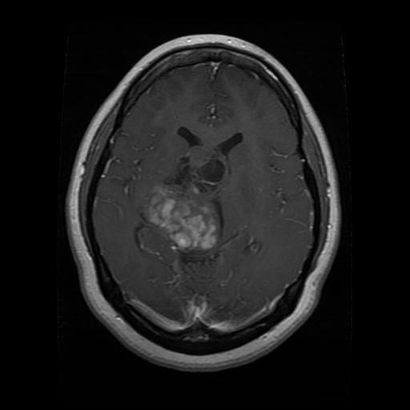</td>
<td></td>
<td>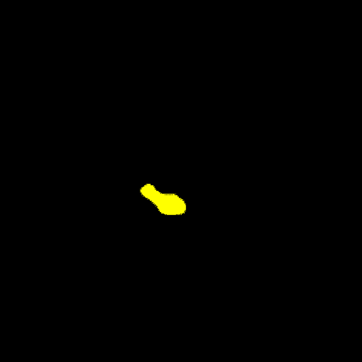</td>
</tr>

<tr>
<td>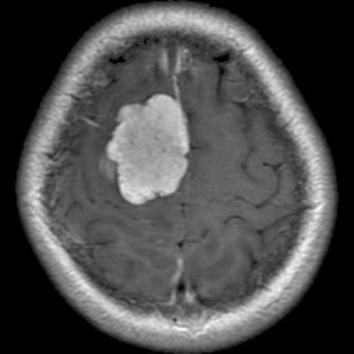</td>
<td>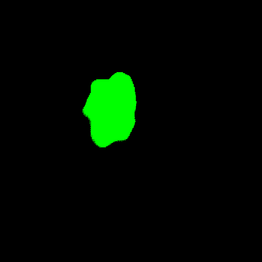</td>
<td></td>
</tr>

<tr>
<td>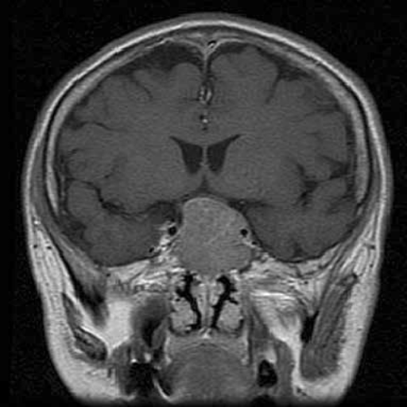</td>
<td></td>
<td>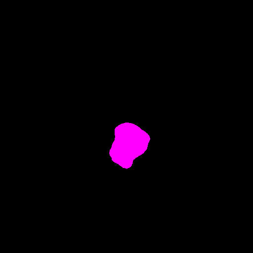</td>
</tr>
</table>

 
<h3>1  Dataset Citation</h3>
The dataset used here was derived from   
<a href="https://www.kaggle.com/datasets/maxwellbernard/brain-tumor-mri-multi-class-dataset/data">
<b>
Brain Tumor MRI Multi-Class Dataset
 
Consolidated Brain Tumor MRI Images from Multiple Kaggle Sources
</b>
</a>  by Maxwell Bernard.
  
The following explanation was taken from above kaggle web site.
  
<b>About Dataset</b> 
This dataset consolidates brain tumor MRI images from multiple Kaggle data sources to create a larger, 
centralised dataset for research and model development purposes.
  
The dataset comprises of 16,269 images containing four main classes :
 
<ul>
<li><b>Glioma</b> (3,325 Images)</li>
<li><b>Meningioma</b> (3,266 Images)</li>
<li><b>Pituitary</b> (2,974 Images)</li>
<li><b>Healthy</b> (6,704 Images)</li>
</ul>
 
<b>Key Notes</b> 
Duplicate images are likely due to dataset overlaps when sourcing. We strongly recommend users perform deduplication before training.
  
The dataset does not apply any cleaning, resizing, or augmentation — it's intended to be raw and inclusive for flexibility.
  
<b>Data Sources</b> 
This dataset combines the following <b>five Kaggle datasets</b>:
<ul style="list-style: none;padding-left: 20;">
<li>
1. <a href="https://www.kaggle.com/datasets/mohammadhossein77/brain-tumors-dataset">Brain Tumors Dataset</a> (Excluded their augmented images) by Seyed Mohammad Hossein Hashemi
</li>
<li>
2.<a href="https://www.kaggle.com/datasets/orvile/pmram-bangladeshi-brain-cancer-mri-dataset">
PMRAM Bangladeshi Brain Cancer MRI Dataset</a> by Orville
</li>
<li>
3. <a href="https://www.kaggle.com/datasets/fernando2rad/brain-tumor-mri-images-17-classes">Brain Tumor MRI Images (17 Classes)</a> by Fernando Feltrin 
(Only T1 glioma/meningioma/healthy images used).
</li>
<li>
4, <a href="https://www.kaggle.com/datasets/masoumehsiar/siardataset">SIAR Dataset</a> by Masoumeh Siar (Only healthy scans used as this was a binary dataset, and did not differentiate the tumor types).
</li>
<li>
5. <a href="https://www.kaggle.com/datasets/rm1000/brain-tumor-mri-scans">Brain Tumor MRI Scans</a> by Rajarshi Mandal
</li>
</ul>

<b>License</b> 
This combined dataset is released under 
<a href="https://creativecommons.org/licenses/by-sa/4.0/">CC BY-SA 4.0</a>
to comply with ShareAlike requirements of source datasets: 
<table>
<tr>
<th>Source Dataset</th><th>Original License</th>
</tr>
<tr>
<td><a href="https://www.kaggle.com/datasets/mohammadhossein77/brain-tumors-dataset">Brain Tumors Dataset</a></td>
<td><a href="https://creativecommons.org/publicdomain/zero/1.0/">CC0</a></td>
</tr>
<tr>
<td><a href="https://www.kaggle.com/datasets/rm1000/brain-tumor-mri-scans">Brain Tumor MRI Scans</a></td>
<td><a href="https://creativecommons.org/publicdomain/zero/1.0/">CC0</a></td>
</tr>
<tr>
<td><a href="https://www.kaggle.com/datasets/masoumehsiar/siardataset">SIAR Dataset</a></td>
<td>Unkown. Requires citation in publications.</td>
</tr>
<tr>
<td><a href="https://www.kaggle.com/datasets/orvile/pmram-bangladeshi-brain-cancer-mri-dataset">PMRAM Bangladeshi Brain Cancer MRI Dataset</a></td>
<td><a href="https://creativecommons.org/licenses/by-sa/4.0/">CC BY-SA 4.0</a></td>
</tr>
<tr>
<td><a href="https://www.kaggle.com/datasets/fernando2rad/brain-tumor-mri-images-17-classes">Brain Tumor MRI Images (17 Classes)</a></td>
<td><a href="https://opendatacommons.org/licenses/odbl/1-0/">ODbL 1.0</a></td>
</tr>
</table>
  
<h3>
2 Brain Tumor MRI ImageMask Dataset
</h3>
<h3>2.1 Download Brain-Tumor-MRI-Multi-Class ImageMask Dataset</h3>
 If you would like to train this Brain-Tumor-MRI-Multi-Class Segmentation model by yourself,
please down load our dataset <a href="https://drive.google.com/file/d/1RN2xP8VOPPPhk63kudH8opmzVIckxEKw/view?usp=sharing">
<b>Brain-Tumor-MRI-Multi-Class-ImageMask-Dataset.zip</b>
(<a href="https://creativecommons.org/licenses/by-sa/4.0/">CC BY-SA 4.0</a>)
</a> on the google drive,
expand the downloaded, and put it under <b>./dataset/</b> to be.
<pre>
./dataset
└─Brain-Tumor-MRI-Multi-Class
    ├─test
    │   ├─images
    │   └─masks
    ├─train
    │   ├─images
    │   └─masks
    └─valid
        ├─images
        └─masks
</pre>
 
<b>Brain-Tumor-MRI-Multi-Class Statistics</b> 
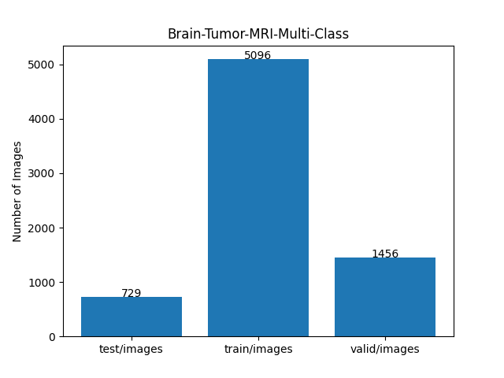 
 
As shown above, the number of images of train and valid datasets is large enough to use for a training set of our segmentation model.
  

<h3>2.2 Derivation of ImageMask Dataset</h3>
The folder structure excluded healthy subset of the original Brain Tumor MRI Multi Class Dataset is the following.
It contains JPG image files of three classes (glioma, meningioma and pituitary).
Since it is a Brain Tumor Classification dataset, it does not contain annotation (segmentation) files corresponding to 
those images.
<pre>
./multi_class_dataset
    ├─glioma
    │   ├─Fernando_Feltrin_glioma_72.jpg
...
    │   └─Rajarshi_Mandal_glioma_5378.jpg
    ├─meningioma
    │   ├─Fernando_Feltrin_meningioma_137.jpg
...
    │   └─Rajarshi_Mandal_meningioma_7023.jpg
    └─pituitary
        ├─Hossein_Hashemi_pituitary_1.jpg
..
        └─Rajarshi_Mandal_pituitary_1757.jpg
</pre>
 
The colorized masks of our dataset were generated by applying a segmentation (inference) method
of a pretrained model <a href="https://github.com/sarah-antillia/TensorFlow-FlexUNet-Image-Segmentation-Mixed-Brain-Tumor-MRI-Regenerated">
TensorFlow-FlexUNet-Image-Segmentation-Mixed-Brain-Tumor-MRI-Regenerated</a> 
to the original three classes JPG images, without human annotation experts.
 
 
<h3>2.3 Train Sample Images and Masks</h3>
<b>Train sample images</b> 
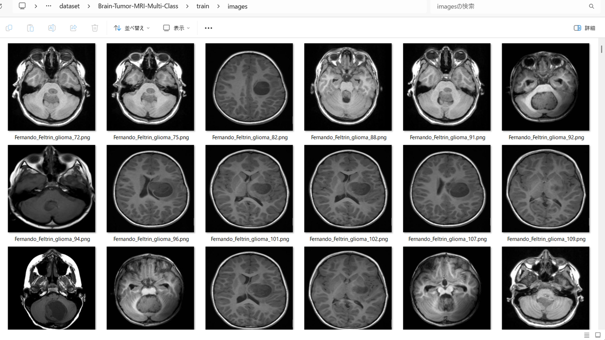
 
<b>Train sample masks</b> 
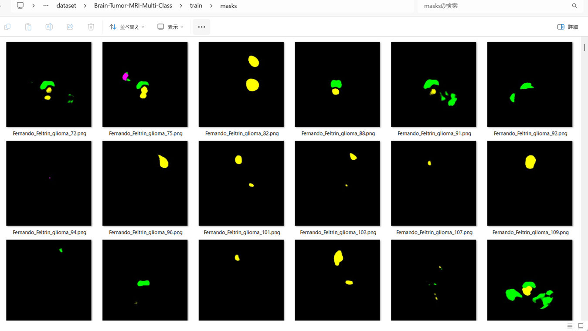
 
<h3>
3 Train TensorflowFlexUNet Model
</h3>
 We trained Brain-Tumor-MRI-Multi-Class TensorflowFlexUNet Model by using the following
<a href="./projects/TensorFlowFlexUNet/Brain-Tumor-MRI-Multi-Class/train_eval_infer.config"> <b>train_eval_infer.config</b></a> file.  
Please move to ./projects/TensorFlowFlexUNet/Brain-Tumor-MRI-Multi-Class and run the following bat file. 
<pre>
>1.train.bat
</pre>
, which simply runs the following command. 
<pre>
>python ../../../src/TensorFlowFlexUNetTrainer.py ./train_eval_infer.config
</pre>

<b>Model parameters</b> 
Defined a small <b>base_filters=16</b> and a large <b>base_kernels=(11,11)</b> for the first Conv Layer of Encoder Block of 
<a href="./src/TensorFlowFlexUNet.py">TensorFlowFlexUNet.py</a> 
and a large <b>num_layers=8</b> (including a bridge between Encoder and Decoder Blocks).
<pre>
[model]
image_width    = 512
image_height   = 512
image_channels = 3
input_normalize = True
normalization  = False
num_classes    = 4
base_filters   = 16
base_kernels  = (11,11)
num_layers    = 8
dropout_rate   = 0.05
dilation       = (1,1)
</pre>

<b>Learning rate</b> 
Defined a small learning rate.  
<pre>
[model]
learning_rate  = 0.00007
</pre>

<b>Loss and metrics functions</b> 
Specified "categorical_crossentropy" and "dice_coef_multiclass". 
<pre>
[model]
loss           = "categorical_crossentropy"
metrics        = ["dice_coef_multiclass"]
</pre>
<b >Learning rate reducer callback</b> 
Enabled learing_rate_reducer callback, and a small reducer_patience.
<pre> 
[train]
learning_rate_reducer = True
reducer_factor     = 0.5
reducer_patience   = 4
</pre>
<b>Early stopping callback</b> 
Enabled early stopping callback with patience parameter.
<pre>
[train]
patience      = 10
</pre>
<b></b> 
<b>RGB color map</b> 
rgb color map dict for Brain-Tumor-MRI-Multi-Class 1+3 classes. 
<pre>
[mask]
mask_file_format = ".png"
;Brain-Tumor-MRI-Multi-Class 1+3
;                   {"Glioma":(255,255,0), "Meningioma":(0,255,0), "Pituitary":(255,0,255)}        
rgb_map = {(0,0,0):0, (255,255,0):1, (0,255,0):2, (255,0,255):3,}       
</pre>
<b>Epoch change inference callbacks</b> 
Enabled epoch_change_infer callback. 
<pre>
[train]
epoch_change_infer       = True
epoch_change_infer_dir   =  "./epoch_change_infer"
epoch_changeinfer        = False
epoch_changeinfer_dir    = "./epoch_changeinfer"
num_infer_images         = 6
</pre>
By using this epoch_change_infer callback, on every epoch_change, the inference procedure can be called
 for 6 images in <b>mini_test</b> folder. This will help you confirm how the predicted mask changes 
 at each epoch during your training process.    
<b>Epoch_change_inference output at starting (1,2,3)</b> 
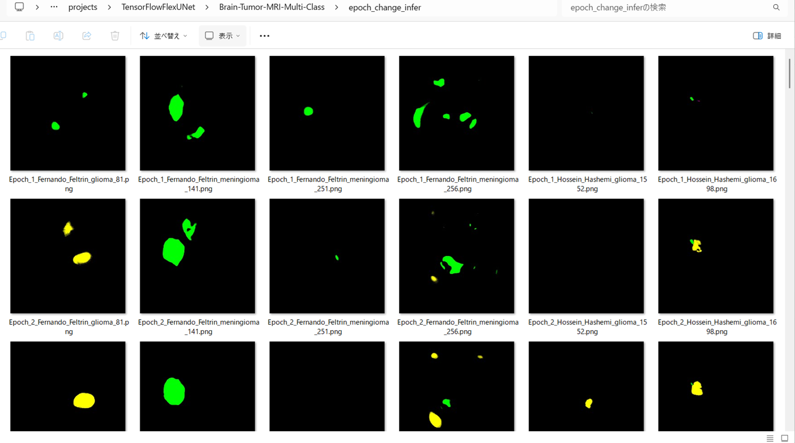 
 
<b>Epoch_change_inference output at middle-point (15,16,17)</b> 
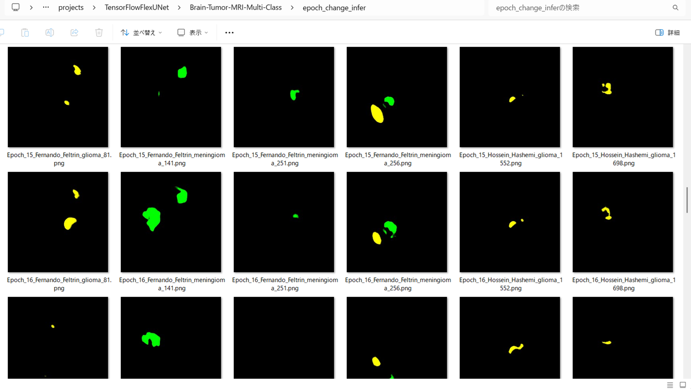 
 
<b>Epoch_change_inference output at ending (31,32,33)</b> 
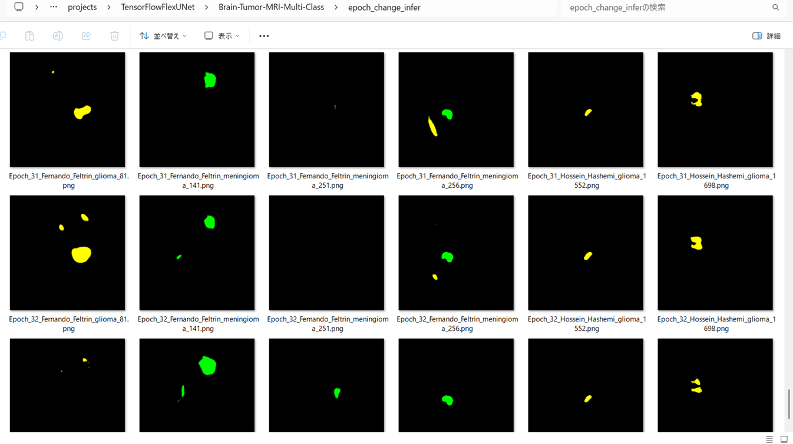 

 
In this experiment, the training process was stopped at epoch 33 by EarlyStoppingCallback.  
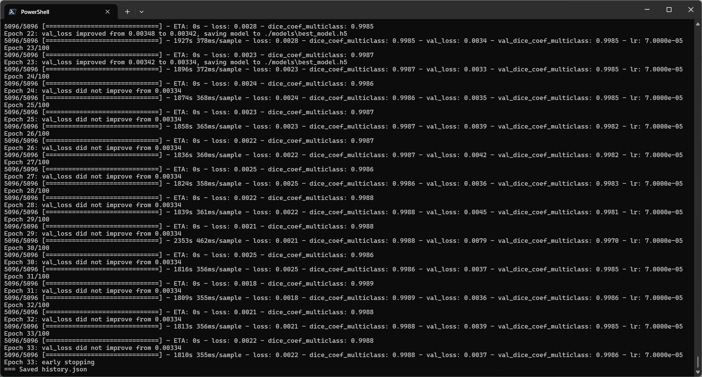 
 
<a href="./projects/TensorFlowFlexUNet/Brain-Tumor-MRI-Multi-Class/eval/train_metrics.csv">train_metrics.csv</a> 
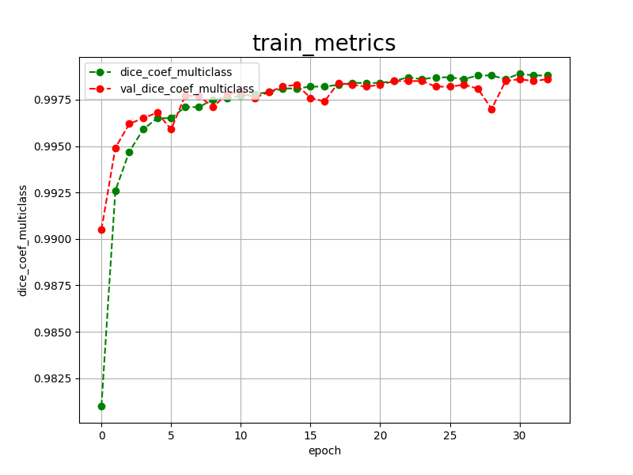 

 
<a href="./projects/TensorFlowFlexUNet/Brain-Tumor-MRI-Multi-Class/eval/train_losses.csv">train_losses.csv</a> 
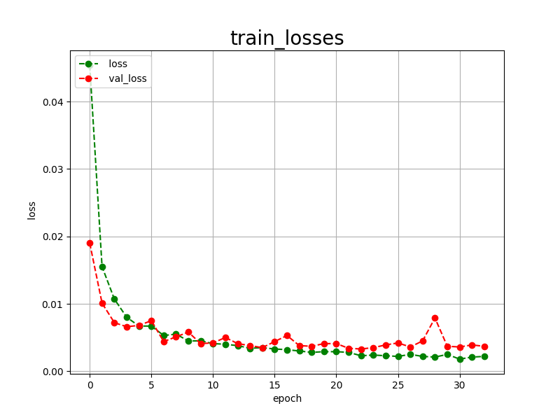 
 
<h3>
4 Evaluation
</h3>
Please move to a <b>./projects/TensorFlowFlexUNet/Brain-Tumor-MRI-Multi-Class</b> folder, 
and run the following bat file to evaluate TensorflowFlexUNet model for Brain-Tumor-MRI-Multi-Class. 
<pre>
>./2.evaluate.bat
</pre>
This bat file simply runs the following command.
<pre>
>python ../../../src/TensorFlowFlexUNetEvaluator.py  ./train_eval_infer.config
</pre>
Evaluation console output: 
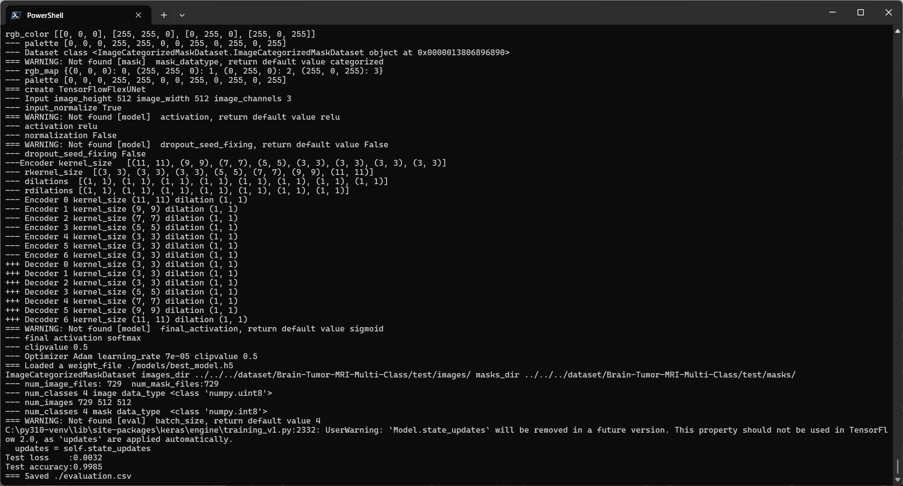
  Image-Segmentation-Brain-Tumor-MRI-Multi-Class

<a href="./projects/TensorFlowFlexUNet/Brain-Tumor-MRI-Multi-Class/evaluation.csv">evaluation.csv</a> 
The loss (categorical_crossentropy) to this Brain-Tumor-MRI-Multi-Class/test was low, and dice_coef_multiclass high as shown below.
 
<pre>
categorical_crossentropy,0.0032
dice_coef_multiclass,0.9985
</pre>
 
<h3>5 Inference</h3>
Please move to a <b>./projects/TensorFlowFlexUNet/Brain-Tumor-MRI-Multi-Class</b> folder 
,and run the following bat file to infer segmentation regions for images by the Trained-TensorflowFlexUNet model for Brain-Tumor-MRI-Multi-Class. 
<pre>
>./3.infer.bat
</pre>
This simply runs the following command.
<pre>
>python ../../../src/TensorFlowFlexUNetInferencer.py ./train_eval_infer.config
</pre>

<b>mini_test_images</b> 
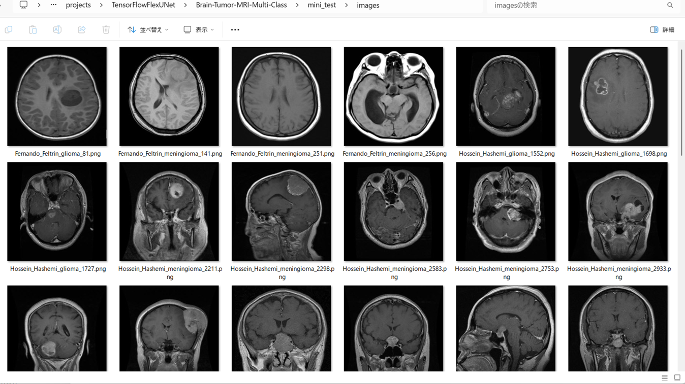 
<b>mini_test_mask(ground_truth)</b> 
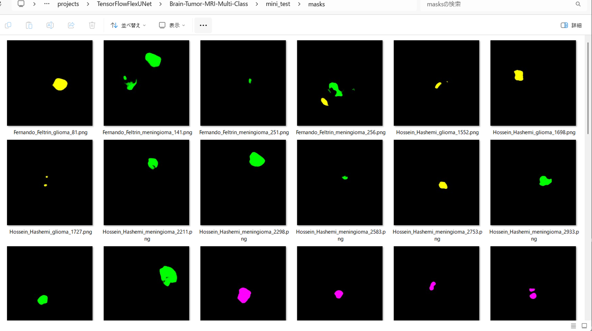 

<b>Inferred test masks</b> 
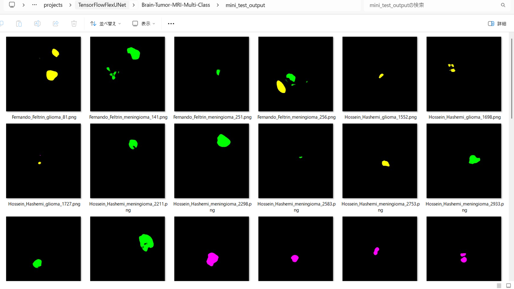 
 

<b>Enlarged images and masks for  Brain-Tumor-MRI-Multi-Class  Images of 512x512 pixels</b> 
As shown below, the inferred masks predicted by our segmentation model trained by the dataset appear similar to the ground truth masks.
  
<b>class_color_map = {Glioma:yellow,  Meningioma:green, Pituitary: mazenta}</b>
 
 
<table>
<tr>
<th>Input: image</th>
<th>Mask (ground_truth)</th>
<th>Prediction: inferred_mask</th>
</tr>
<tr>
<td>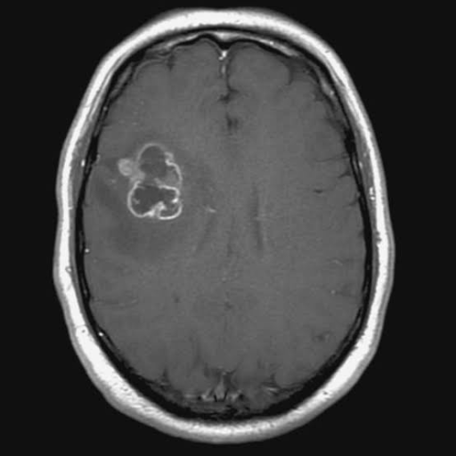</td>
<td>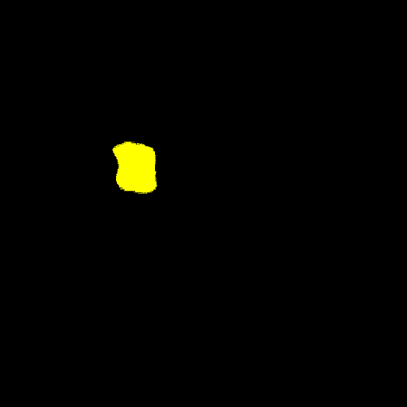</td>
<td>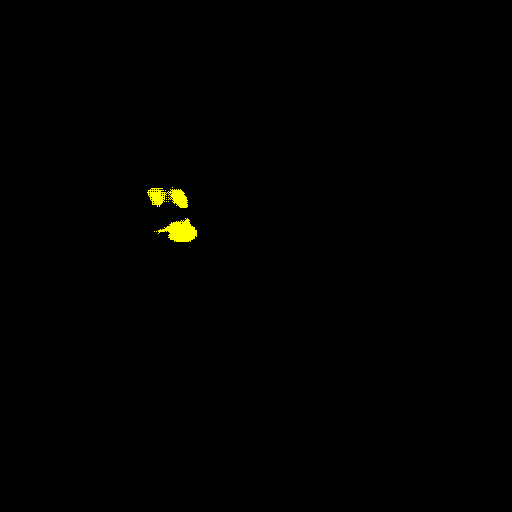</td>
</tr>

<tr>
<td>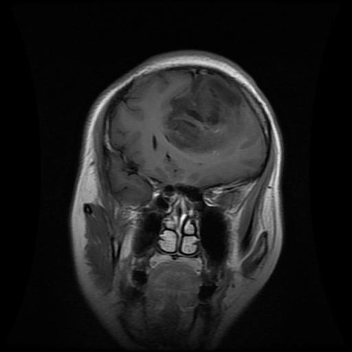</td>
<td></td>
<td>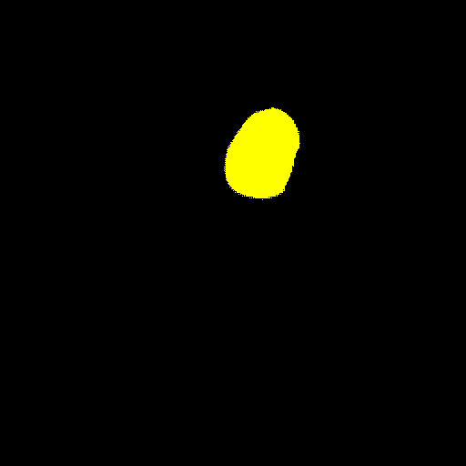</td>
</tr>

<tr>
<td>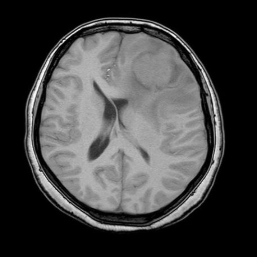</td>
<td>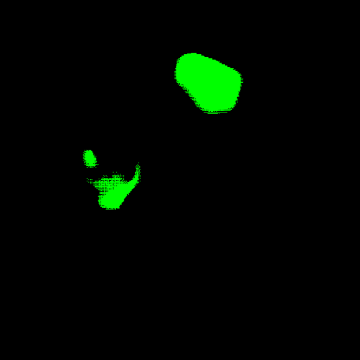</td>
<td>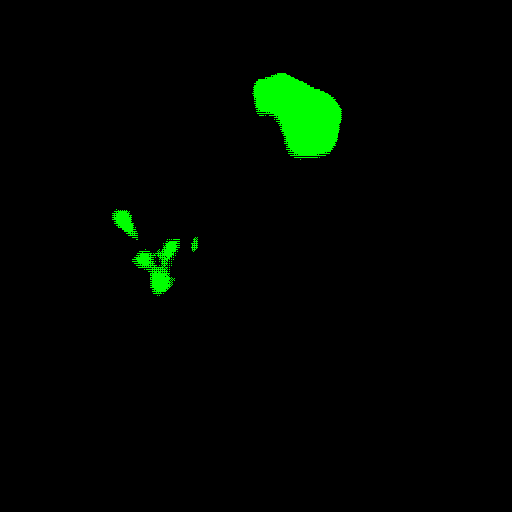</td>
</tr>
<tr>
<td>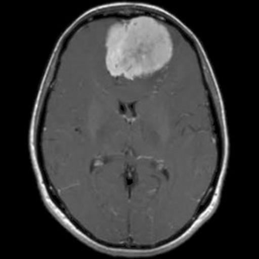</td>
<td>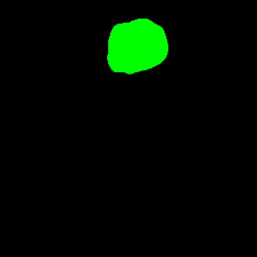</td>
<td></td>
</tr>
<tr>
<td></td>
<td></td>
<td></td>
</tr>
<tr>
<td>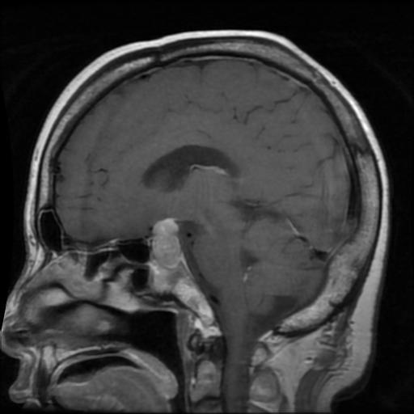</td>
<td></td>
<td>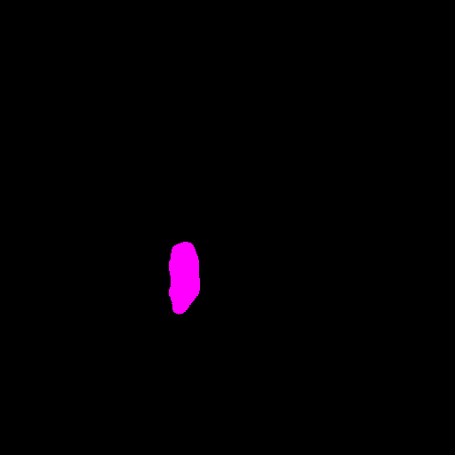</td>
</tr>
</table>

 
<h3>
References
</h3>
<b>1. TensorFlow-FlexUNet-Image-Segmentation-Figshare-BrainTumor</b> 
Toshiyuki Arai  
<a href="https://github.com/sarah-antillia/TensorFlow-FlexUNet-Image-Segmentation-Figshare-BrainTumor">
https://github.com/sarah-antillia/TensorFlow-FlexUNet-Image-Segmentation-Figshare-BrainTumor
</a>
 
 
<b>2. TensorFlow-FlexUNet-Image-Segmentation-Brain-Tumor-MRI</b> 
Toshiyuki Arai  
<a href="https://github.com/sarah-antillia/TensorFlow-FlexUNet-Image-Segmentation-Brain-Tumor-MRI">
https://github.com/sarah-antillia/TensorFlow-FlexUNet-Image-Segmentation-Brain-Tumor-MRI
</a>
 
 
<b>3. TensorFlow-FlexUNet-Image-Segmentation-BRISC2025-BrainTumor</b> 
Toshiyuki Arai  
<a href="https://github.com/sarah-antillia/TensorFlow-FlexUNet-Image-Segmentation-BRISC2025-BrainTumor">
https://github.com/sarah-antillia/TensorFlow-FlexUNet-Image-Segmentation-BRISC2025-BrainTumor
</a>
 
 
<b>4. TensorFlow-FlexUNet-Image-Segmentation-Mixed-Brain-Tumor-MRI-Regenerated</b> 
Toshiyuki Arai  
<a href="https://github.com/sarah-antillia/TensorFlow-FlexUNet-Image-Segmentation-Mixed-Brain-Tumor-MRI-Regenerated">
https://github.com/sarah-antillia/TensorFlow-FlexUNet-Image-Segmentation-Mixed-Brain-Tumor-MRI-Regenerated
</a>
 
 
<b>5. TensorFlow-FlexUNet-Image-Segmentation-Model</b> 
Toshiyuki Arai  
<a href="https://github.com/sarah-antillia/TensorFlow-FlexUNet-Image-Segmentation-Model">
TensorFlow-FlexUNet-Image-Segmentation-Model
</a>
 
 
